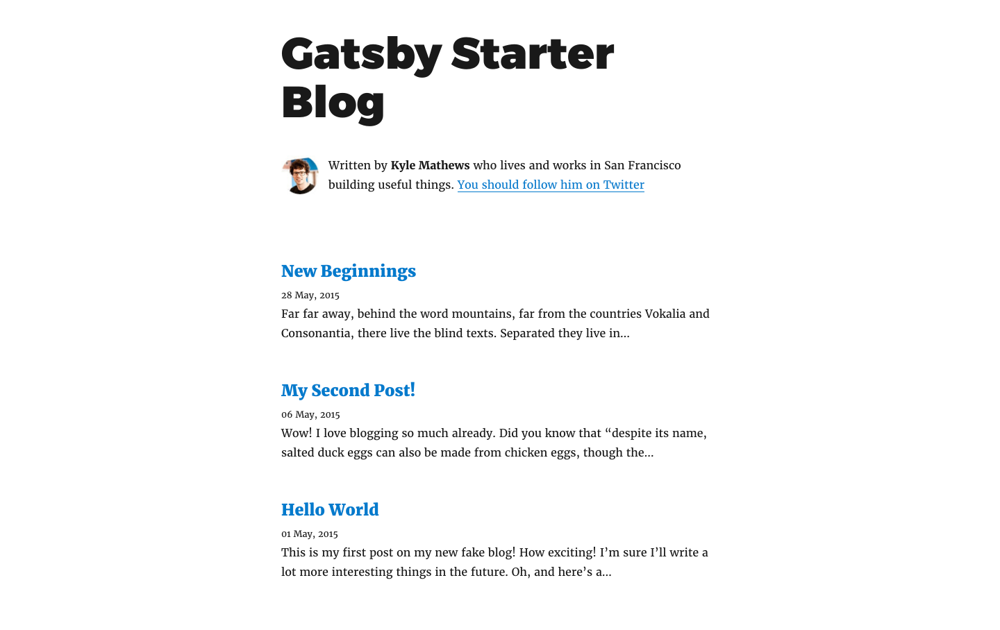

In this guide, we'll look at how we can host our blog site on [Netlify](https://www.netlify.com/) built on Gatsby.

Netlify gives an all-in-one workflow that combines global deployment, continuous integration, and automatic HTTPS.

### Setup Gatsby Project

We'll install Gatsby CLI(Command Line Interface) package globaly, so that we can access gatsby commands in our terminal directly.

```
npm install --global gatsby-cli
```

Now, let's create our own blog site. This will create a new nodejs project and install dependencies:

```
gatsby new my-gatsby-blog https://github.com/gatsbyjs/gatsby-starter-blog
```

Go to newly created site folder:

```
cd my-gatsby-blog
```

Run below command to start Gatsby development console:

```
gatsby develop
```

You should be able see `Gatsby Default Starter` at [http://localhost:8000](http://localhost:8000).

As we run above command, we will see below message on the console

### Production Build

```
Note that the development build is not optimized.
To create a production build, use gatsby build
```

So we will need to run below command for production build.

```
gatsby build
```

This will generate `public` folder at project root path.

We can test our production build using npm `serve` package.

```
npm i -g serve
```

```
serve -s public
```

and go to [http://localhost:5000](http://localhost:5000) in your browser, you should able to see same screen as developement server but now it is optimized for production use.

Now login in/sign up on [Netlify](https://app.netlify.com/), drag and drop public folder on

```
    Need to share a quick prototype or publish a simple mockup?
             Drag and drop your site folder here
```

Netlify will create new site with random name start uploading and hosting our files. in few moments, it will give us our site url like `our-project-name.netlify.com`.



- In Domain Settings, we can add our domain and set `CNAME` record as our netlify url from your DNS provider. Now we should be able to see our netlify project at our domain url.

### Other resources

Below are some helpful resources

- [A Step-by-Step Guide: Gatsby on Netlify](https://www.netlify.com/blog/2016/02/24/a-step-by-step-guide-gatsby-on-netlify/)
- [Gatsby Netlify CMS](https://www.gatsbyjs.org/packages/gatsby-plugin-netlify-cms)
- [Gatsby + Netlify CMS Starter](https://github.com/netlify-templates/gatsby-starter-netlify-cms)
